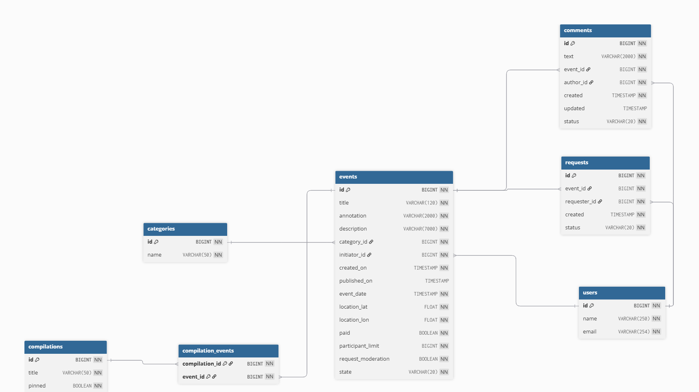
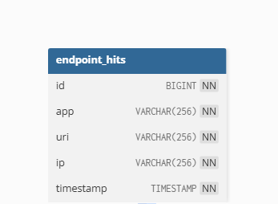

# Event Explorer Platform
RESTful API сервис для организации и поиска событий

Backend-сервис, аналог Афиши, позволяющий пользователям находить мероприятия, подавать заявки на участие, создавать подборки и комментировать события. Реализован на Spring Boot с использованием микросервисной архитектуры для разделения основной логики и статистики.

## Технологии и инструменты

### Основной сервис (ewm-service):
- **Язык**: Java 21
- **Фреймворк**: Spring Boot 3.3.2 (Web, Validation, Data JPA, Test, Actuator)
- **База данных**: PostgreSQL 16.1, H2 (in-memory для тестирования)
- **ORM**: Spring Data JPA, Hibernate
- **Библиотеки**: Project Lombok
- **Логирование**: Logbook (для HTTP-трафика), SLF4J (для бизнес-логики)

### Сервис статистики (stats-server):
- **Язык**: Java 21
- **Фреймворк**: Spring Boot 3.3.2
- **База данных**: PostgreSQL 16.1
- **HTTP Клиент**: RestTemplate, Apache HttpClient5

### Инфраструктура:
- **Контейнеризация**: Docker, Docker Compose
- **Система сборки**: Maven (multi-module)
- **Документация API**: (Готов к интеграции Swagger/OpenAPI)

## Функциональность

### Управление пользователями
- Полный CRUD для пользователей через административный API
- Проверка уникальности email
- Каскадное удаление всех связанных данных
- Поиск пользователей по списку ID с пагинацией

### Управление категориями
- Создание, редактирование и удаление категорий (админ)
- Публичный доступ к списку категорий
- Валидация уникальности названий
- Защита от удаления используемых категорий

### Управление событиями
- Полный CRUD для событий
- Создание событий пользователями с валидацией дат (минимум 1 час от текущего момента)
- Система модерации: PENDING → PUBLISHED/CANCELED
- Расширенный поиск событий с фильтрацией по тексту, категориям и другим параметрам
- Управление лимитами участников и настройками модерации

### Система запросов на участие
- Подача заявок на участие в событиях
- Автоматическое подтверждение для событий без модерации
- Валидация прав (нельзя участвовать в своем событии)
- Отмена заявок пользователями
- Статусы: PENDING, CONFIRMED, REJECTED, CANCELED

### Управление подборками
- Создание и редактирование подборок событий (админ)
- Гибкое управление составом подборок
- Публичный доступ с фильтрацией по закреплению

### Система комментариев 
- Полный CRUD для комментариев
- Многоуровневая модерация: PENDING → PUBLISHED/REJECTED/EDITED
- Редактирование комментариев авторами
- Валидация прав (только автор может редактировать/удалять)
- Комментирование только опубликованных событий

### Сервис статистики
- Запись информации о просмотрах событий
- Предоставление статистики за выбранные даты
- Подсчет уникальных и общих просмотров
- Интеграция с основным сервисом через HTTP клиент

## Качество кода и надежность
- Комплексная валидация входящих данных на уровне контроллеров (@Valid) и бизнес-логики
- Централизованная обработка исключений с помощью @ControllerAdvice
- Покрытие тестами postman всех модулей приложения
- Детальное логирование всех операций
- Статический анализ кода (Checkstyle)

## Архитектура и ключевые решения

Проект реализован по модульной микросервисной архитектуре:

### Основной сервис (ewm-service)
Реализован по классической трехслойной архитектуре:

- **Controller Layer**: REST-контроллеры, разделенные по уровням доступа:
    - Публичные (/events, /categories, /compilations, /events/{eventId}/comments)
    - Приватные (/users/{userId}/events, /users/{userId}/requests, /users/{userId}/comments)
    - Административные (/admin/users, /admin/categories, /admin/events, /admin/comments)

- **Service Layer**: Содержит всю бизнес-логику:
    - Валидация дат событий и бизнес-правил
    - Управление статусами заявок на участие
    - Модерация событий и комментариев
    - Интеграция с сервисом статистики

- **Repository Layer**: Взаимодействие с базой данных через Spring Data JPA.

### Сервис статистики (stats-server)
Много-модульный проект:
- **stats-service**: REST API для сбора и предоставления статистики
- **stats-client**: HTTP клиент для интеграции с основным сервисом
- **stats-dto**: Общие DTO для передачи данных между сервисами

### Что выделяет этот проект:
- **Модульная архитектура**: Четкое разделение на независимые Maven модули позволяет переиспользовать компоненты.
- **BaseClient абстракция**: Универсальный HTTP клиент с обработкой ошибок для взаимодействия между сервисами.
- **Сложная бизнес-логика**: Реализованы комплексные валидации:
    - Проверка дат событий 
    - Валидация прав доступа (авторство событий и комментариев)
    - Управление лимитами участников с подтверждением заявок
    - Многоуровневая модерация контента

## Схема базы данных

### Основной сервис (ewm-main):


### Сервис статистики (stats-service):



## Запуск проекта

### Предварительные требования
- Установленный JDK 21
- Установленный Maven 3.8+
- Установленный Docker 20.10+ (рекомендуется)

### 1. Клонирование и сборка
```bash
git clone https://github.com/ucheniks/event-explorer-platform.git
cd event-explorer-platform
mvn clean package 
```

### 2. Запуск через Docker Compose (рекомендуется)
```bash
docker-compose up -d
```

### 3. Локальный запуск
 Запуск сервиса статистики
```bash
cd stats-service/stats-service
mvn spring-boot:run
```

 Запуск основного сервиса (в отдельном терминале)
```bash
cd ewm-service
mvn spring-boot:run
```

Сервисы будут доступны:

- Основной сервис: http://localhost:8080
- Сервис статистики: http://localhost:9090


## API Reference

### Admin: Пользователи
| Метод | Эндпоинт | Описание |
|-------|-----------|-----------|
| GET | `/admin/users` | Получить пользователей |
| POST | `/admin/users` | Создать пользователя |
| DELETE | `/admin/users/{userId}` | Удалить пользователя |

### Admin: Категории
| Метод | Эндпоинт | Описание |
|-------|-----------|-----------|
| POST | `/admin/categories` | Создать категорию |
| PATCH | `/admin/categories/{catId}` | Изменить категорию |
| DELETE | `/admin/categories/{catId}` | Удалить категорию |

### Admin: События
| Метод | Эндпоинт | Описание |
|-------|-----------|-----------|
| GET | `/admin/events` | Поиск событий |
| PATCH | `/admin/events/{eventId}` | Редактирование события |

### Admin: Подборки
| Метод | Эндпоинт | Описание |
|-------|-----------|-----------|
| POST | `/admin/compilations` | Создать подборку |
| PATCH | `/admin/compilations/{compId}` | Обновить подборку |
| DELETE | `/admin/compilations/{compId}` | Удалить подборку |

### Admin: Комментарии
| Метод | Эндпоинт | Описание |
|-------|-----------|-----------|
| GET | `/admin/comments` | Поиск комментариев |
| PATCH | `/admin/comments/{commentId}/publish` | Опубликовать комментарий |
| PATCH | `/admin/comments/{commentId}/reject` | Отклонить комментарий |
| DELETE | `/admin/comments/{commentId}` | Удалить комментарий |

### Private: События
| Метод | Эндпоинт | Описание |
|-------|-----------|-----------|
| GET | `/users/{userId}/events` | Получить события пользователя |
| POST | `/users/{userId}/events` | Создать событие |
| GET | `/users/{userId}/events/{eventId}` | Получить событие по ID |
| PATCH | `/users/{userId}/events/{eventId}` | Изменить событие |
| GET | `/users/{userId}/events/{eventId}/requests` | Получить запросы на участие |
| PATCH | `/users/{userId}/events/{eventId}/requests` | Изменить статусы заявок |

### Private: Запросы на участие
| Метод | Эндпоинт | Описание |
|-------|-----------|-----------|
| GET | `/users/{userId}/requests` | Получить мои заявки |
| POST | `/users/{userId}/requests` | Создать заявку на участие |
| PATCH | `/users/{userId}/requests/{requestId}/cancel` | Отменить заявку |

### Private: Комментарии
| Метод | Эндпоинт | Описание |
|-------|-----------|-----------|
| POST | `/users/{userId}/comments` | Создать комментарий |
| PATCH | `/users/{userId}/comments/{commentId}` | Изменить комментарий |
| DELETE | `/users/{userId}/comments/{commentId}` | Удалить комментарий |

### Public: События
| Метод | Эндпоинт | Описание |
|-------|-----------|-----------|
| GET | `/events` | Получить события с фильтрацией |
| GET | `/events/{id}` | Получить событие по ID |

### Public: Категории
| Метод | Эндпоинт | Описание |
|-------|-----------|-----------|
| GET | `/categories` | Получить категории |
| GET | `/categories/{catId}` | Получить категорию по ID |

### Public: Подборки
| Метод | Эндпоинт | Описание |
|-------|-----------|-----------|
| GET | `/compilations` | Получить подборки событий |
| GET | `/compilations/{compId}` | Получить подборку по ID |

### Public: Комментарии
| Метод | Эндпоинт | Описание |
|-------|-----------|-----------|
| GET | `/events/{eventId}/comments` | Получить комментарии события |
| GET | `/events/{eventId}/comments/{commentId}` | Получить комментарий по ID |

### Stats Service
| Метод | Эндпоинт | Описание |
|-------|-----------|-----------|
| POST | `/hit` | Сохранить информацию о запросе |
| GET | `/stats` | Получить статистику по посещениям |


## Примеры запросов

### Создание пользователя
```bash
curl -X POST http://localhost:8080/admin/users \
  -H "Content-Type: application/json" \
  -d '{
    "name": "Иван Петров",
    "email": "ivan@mail.ru"
  }'
```

### Создание категории
```bash
curl -X POST http://localhost:8080/admin/categories \
-H "Content-Type: application/json" \
-d '{
"name": "Концерты"
}'
```

### Создание события
```bash
curl -X POST http://localhost:8080/users/1/events \
-H "Content-Type: application/json" \
-d '{
"title": "Рок-фестиваль",
"annotation": "Крупнейший рок-фестиваль года с участием мировых звезд",
"description": "Ежегодный рок-фестиваль, собирающий лучшие группы со всей страны. Два дня незабываемой музыки, световое шоу и атмосфера настоящего рока...",
"eventDate": "2026-01-15 18:00:00",
"category": 1,
"location": {
"lat": 33.3333,
"lon": 33.3333
},
"paid": true,
"participantLimit": 5000,
"requestModeration": true
}'
```

### Подача заявки на участие
```bash
curl -X POST "http://localhost:8080/users/2/requests?eventId=1"
```

### Создание комментария
```bash
curl -X POST "http://localhost:8080/users/2/comments?eventId=1" \
-H "Content-Type: application/json" \
-d '{
"text": "Жду не дождусь этого события!"
}'
```

### Поиск событий
```bash
curl "http://localhost:8080/events?text=рок&categories=1&paid=true&onlyAvailable=true&from=0&size=10"
```

### Получение статистики
```bash
curl "http://localhost:9090/stats?start=2025-01-01%20:00:00&end=2025-01-31%20:00:00&uris=/events/1&unique=true"
```


## Тестирование

Проект покрыт комплексными тестами всех слоев приложения:

- **Postman**: Тестирование всех слоев приложения


## Вывод

Данный проект представляет собой законченный бэкенд-сервис с продуманной модульной архитектурой и полным набором функциональности для платформы событий.

Реализация демонстрирует понимание принципов разработки современных серверных приложений:

- Проектирование REST API с разделением уровней доступа
- Работа с реляционными базами данных через JPA
- Организация бизнес-логики в микросервисной архитектуре
- Обработка ошибок и исключений
- Тестирование всех слоев приложения
- Комплексная валидация бизнес-правил

Особенностью проекта является эффективная модульная структура с разделением на stats-client, stats-dto и stats-service для обеспечения слабой связанности компонентов.
